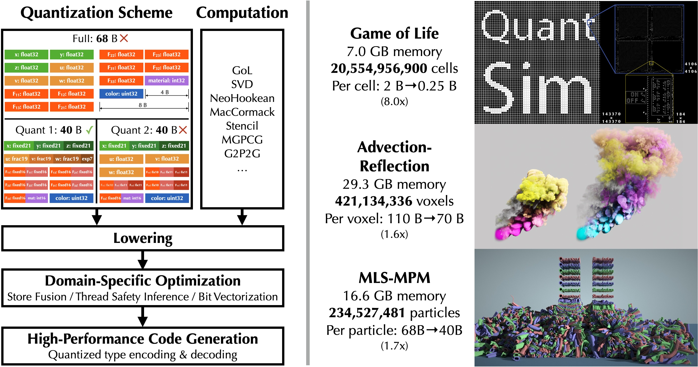
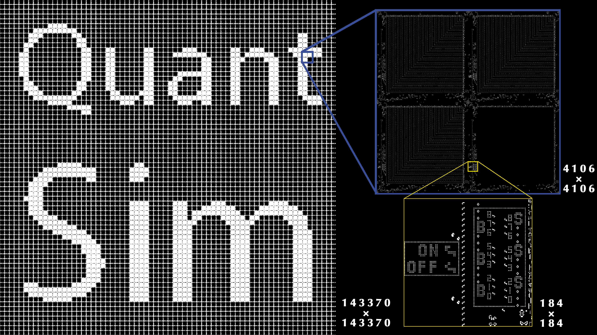

# QuanTaichi: A Compiler for Quantized Simulations (SIGGRAPH 2021)

*Yuanming Hu, Jiafeng Liu, Xuanda Yang, Mingkuan Xu, Ye Kuang, Weiwei Xu, Qiang Dai, William T. Freeman, Fredo Durand*



[[Paper]](https://yuanming.taichi.graphics/publication/2021-quantaichi/quantaichi.pdf) [[Video]](https://youtu.be/0jdrAQOxJlY)

The QuanTaichi framework is now officially part of Taichi. This repo only contains examples.
### Simulate more with less memory, using a quantization compiler.
High-resolution simulations can deliver great visual quality, but they are often limited by available memory. We present a compiler for physical simulation that can achieve both high performance and significantly reduced memory costs, by enabling flexible and aggressive quantization.   

To achieve that, we implement an extension of type system in `Taichi`. Now, programmers can define custom data types using the following code:
```python
i8 = ti.quant.int(bits=8, signed=True)
fixed12 = ti.quant.fixed(frac=12, signed=False, range=3.0)
cft16 = ti.quant.float(exp=5, frac=11, signed=True)
```
The compiler will automatically quantize or dequantize the data for storage. Since the custom data types are not natively supported on hardwares, we propose two useful types of bit adapters: `Bit structs` and `Bit arrays` to pack thses types into hardware supported types with bit width 8, 16, 32, 64. For example, The following code declears 2 fields with custom types, and materialized them into two 2D 4 x 2 arrays with `Bit structs`:
```python
u4 = ti.quant.int(bits=4, signed=False)
i12 = ti.quant.int(bits=12, signed=True)
p = ti.field(dtype=u4)
q = ti.field(dtype=i12)
ti.root.dense(ti.ij, (4, 2)).bit_struct(num_bits=16).place(p, q)
```
The p and q fields are laid in an array of structure (AOS) order in memory. Note the containing bit struct of a (p[i, j], q[i, j]) is 16-bit wide. For more details of the usage of our quantization type system, please refer to our paper or see the examples in this repo.

Under proper quantization, we achieve 8× higher memory efficiency on each Game of Life cell, 1.57× on each Eulerian fluid simulation voxel, and 1.7× on each material point method particle. To the best of our knowledge, this is the first time these high-resolution simulations can run on a single GPU. Our system achieves resolution, performance, accuracy, and visual quality simultaneously.

## How to run

### Install the latest Taichi first.
Install the latest Taichi by:
```
python3 -m pip install —U taichi
```

### Game of Life (GoL)



To reproduce the GOL galaxy:
```
cd gol && python3 galaxy.py -a [cpu/cuda] -o output
```
We suggest you run the script using GPU (`--arch cuda`). Because to better observe the evolution of metapixels, we set the steps per frame to be 32768 which will take quite a while on CPUs.

To reproduce the super large scale GoL:

1. Download the pattern `quant_sim_meta.rle` from our [Google Drive](https://drive.google.com/file/d/1kCg2fSAlQgy42cGAatVwuvGZd7RlqLF-/view?usp=sharing) and place it in the same folder with `quant_sim.py`

2. Run the code
```
python3 quant_sim.py -a [cpu/cuda] -o output
```

For more details, please refer to this [documentation](gol/README.md)

### MLS-MPM


To test our system on hybrid Lagrangian-Eulerian methods where both particles and grids are used, we implemented the Moving Least Squares Material Point Method with G2P2G transfer.

To reproduce, please see the output of the following command:
```
cd mls-mpm
python3 -m demo.demo_quantized_simulation_letters --help
```
You can add `-s` flag for a quick visualization and you may need to wait for 30 frames to see letters falling down.

More details are in this [documentation](mls_mpm/README.md).

### Eulerian Fluid


We developed a sparse-grid-based advection-reflection fluid solver to evaluate our system on grid-based physical simulators.

To reproduce the large scale somke simulation demo, please first change directory into `eulerain_fluid`, and run:
```
python3 run.py --demo [0/1] -o outputs
```
Set the arg of `demo` to `0` for the bunny demo and `1` for the flow demo. `-o outputs` means the set the output folder to `outputs`.

For more comparisons of this quantized fluid simualtion, please refer to the [documentation](eulerian_fluid/readme.md) of this demo.

### Microbenchmarks
To reproduce the experiments of microbenchmarks, please try

```
cd microbenchmarks
chmod +x run_microbenchmarks.sh
./run_microbenchmarks.sh
```
Please refer to this [Readme](microbenchmarks/README.md) to get more details.


Bibtex
```
@article{hu2021quantaichi,
  title={QuanTaichi: A Compiler for Quantized Simulations},
  author={Hu, Yuanming and Liu, Jiafeng and Yang, Xuanda and Xu, Mingkuan and Kuang, Ye and Xu, Weiwei and Dai, Qiang and Freeman, William T. and Durand, Frédo},
  journal={ACM Transactions on Graphics (TOG)},
  volume={40},
  number={4},
  year={2021},
  publisher={ACM}
}
```