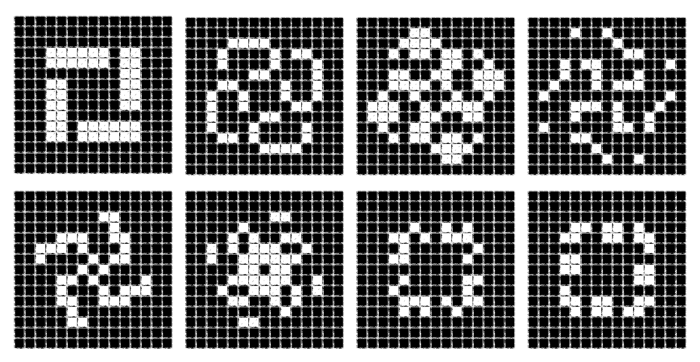
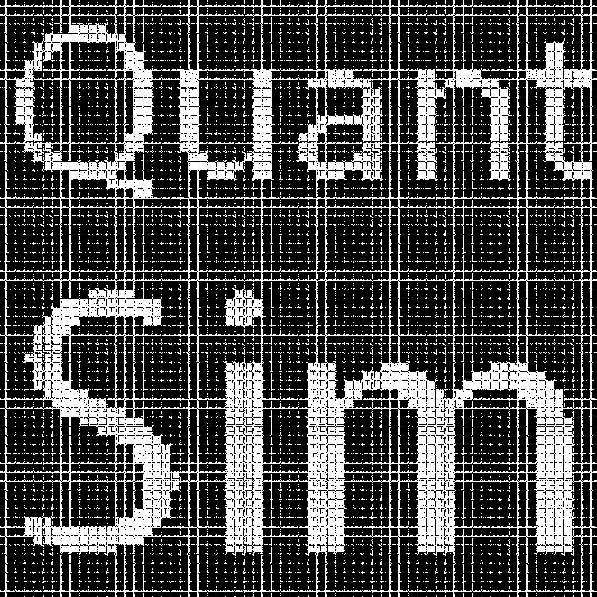

# Quantized Game of Life


## Metapixel Galaxy

A quantized game of life displaying metapixel galaxy pattern (Fig. 12 in our paper)

### How to Run

```
python galaxy.py --arch [cpu/cuda] -o [output_dir]
```

We suggest you run the script using GPU (`--arch cuda`). Because to better observe the evolution of metapixels, we set the steps per frame to be 32768 which will take quite a while on CPUs.

### Results



## Quant Sim

A super high-resolution game of life displaying letters of "QUANT SIM" (Fig. 1 in our paper)

### How to Run
1. Download the pattern `quant_sim_meta.rle` from our [Google Drive](https://drive.google.com/file/d/1kCg2fSAlQgy42cGAatVwuvGZd7RlqLF-/view?usp=sharing) and place it in the same folder with `quant_sim.py`

2. Run the code
```
python quant_sim.py -o [output_dir] --gpu
```

### Note

1. The pattern file for this demo contains 20B cells in Run-Length Encoding format. We use a naive serial parsing method to parse the pattern file so it may take one hour to finish the pattern loading.

2. Before offloading the pattern to GPU and running Taichi kernels, we first store it into a large Numpy array which will require approximately 19GB of host memory, so please make sure your workstation/server has enough memory.

3. This demo requires a minimal of 7GB of device memory, so please make sure your GPU meets this requirement.


### Results




